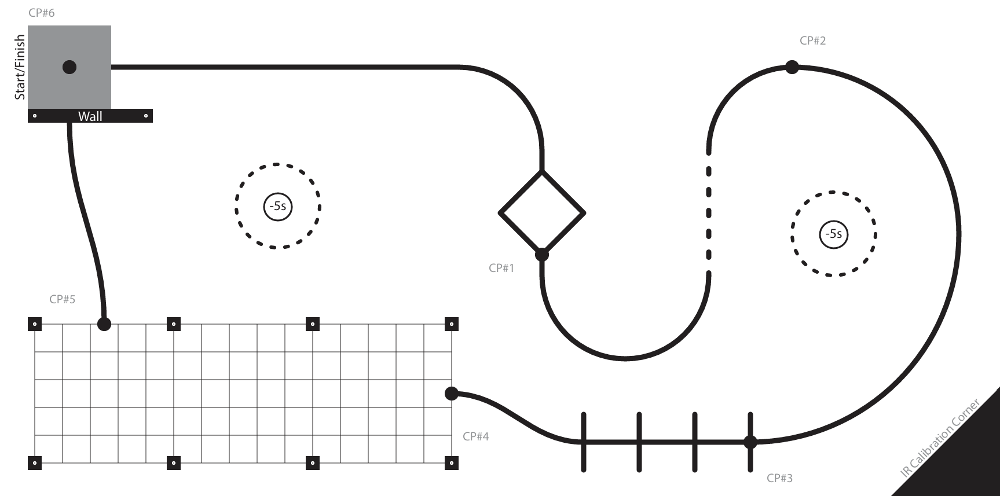
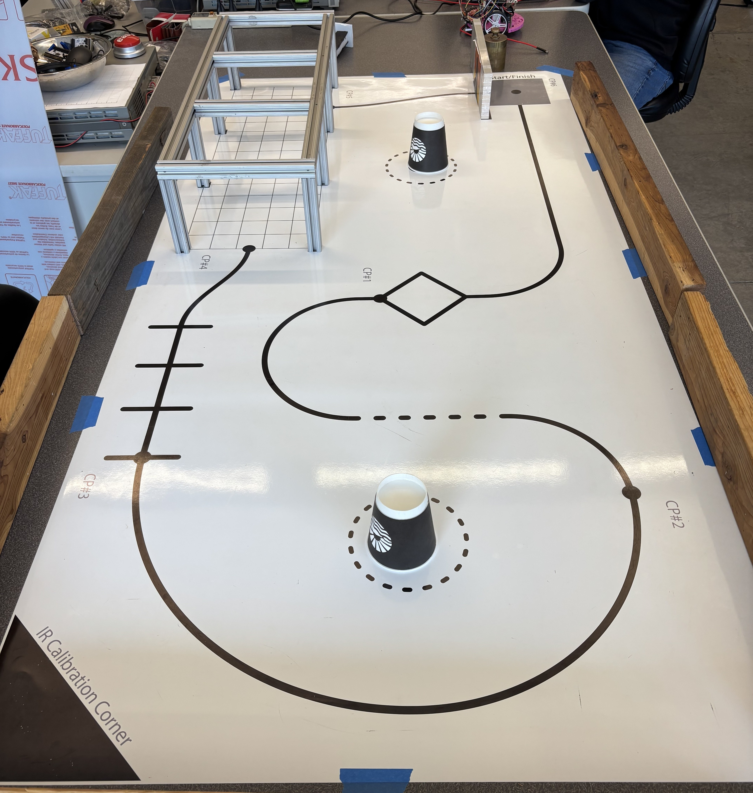

# Requirements

## Evaluation Criteria

The final obstacle course is graded based on the following considerations:
1. Completion 
2. Time
3. Repeatability

The intended approach is to use the IR sensor to follow the black line and then 
switch to a kinematic model for the gridded area. Romi will navigate to the 
wall, and a bump switch will trigger a task dedicated to driving around the wall
to finish. The game track has 5 checkpoint positions where Romi can start from 
once reached. Optional time deductions can be earned by knocking down cups 
within the dotted circles. Variations in the black line are also included to try 
and confuse the line tracking.

---
## Preformance Metrics
Our design focuses on **completion** and **repeatability**. We view this as a
trade-off with completion time, as having Romi run at higher speeds would 
require more aggressive control and testing. Additionally, our approach is to 
have Romi complete the course in one attempt, rather than starting from various 
checkpoints. This was done to create a reliable program and to strengthen our 
understanding of the system.

 

