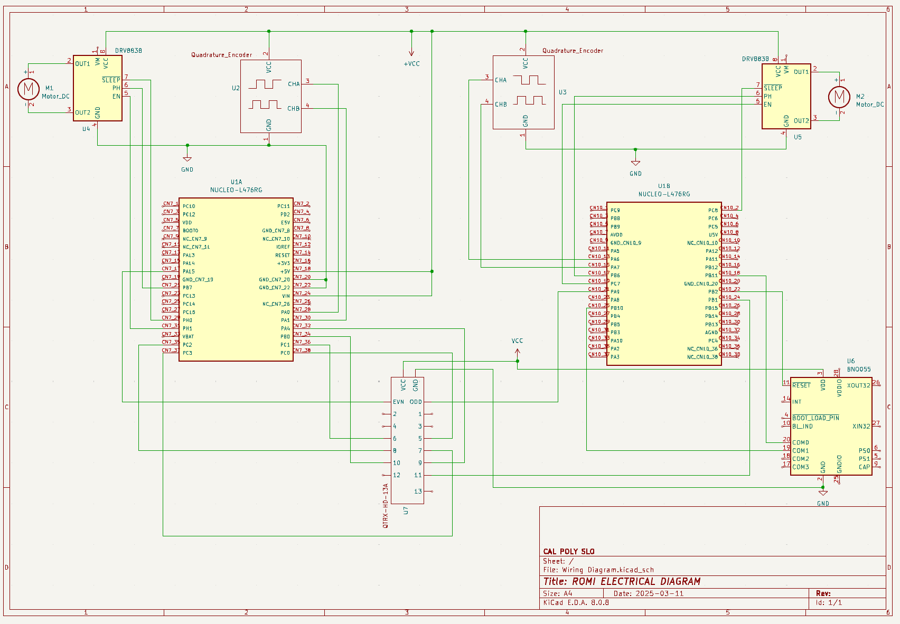

# Romi Design

##  Required Hardware

1. [NUCLEO-L476RG](https://www.st.com/en/evaluation-tools/nucleo-l476rg.html#st_description_sec-nav-tab)
2. [Shoe of Brian](https://spluttflob.github.io/ME405-Support/shoe_info.html)
3. [IR Reflectance Sensor](https://www.pololu.com/product/4215)
4. [HC-05 Bluetooth Module](https://www.amazon.com/dp/B01MQKX7VP)
5. [Romi Chassis Kit](https://www.pololu.com/product/3500)
6. [Motor Driver and Power Distribution Board](https://www.pololu.com/product/3543)
7. [Left](https://www.pololu.com/product/3673) and [Right](https://www.pololu.com/product/3674) bump switches
8. [BNO055 9-DOF IMU](https://www.adafruit.com/product/2472)
9. [Dupont Ribbons](https://www.amazon.com/dp/B07GCY6CH7?th=1)

*Additional items needed for Romi include AA batteries and a USB-Mini-B cable.*

---
## Mechanical Design
*exploded assembly view*

---
## Electrical Design
Pin assignments for NUCLEO interfacing with hardware were selected based on the 
component or sensor requirements. For instance, the BNO055 IMU utilizes I2C 
communication for integration, addressing, and flexibility, while the IR sensor 
reads ADC pins to ensure proper calibration, performance, and processing. 
Additionally, motors and encoders were configured to use the least amount of 
timers possible.

*Note: The HC-05 Bluetooth module was intended to utilize UART communication, 
but ended up out of scope for our project.*

