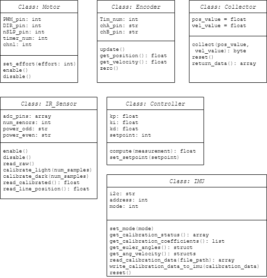
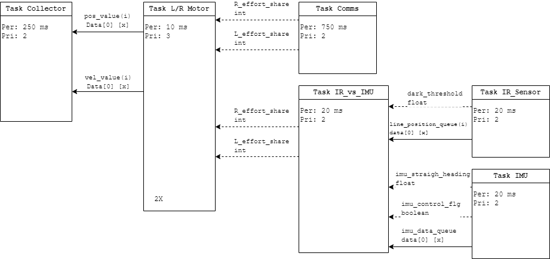

# Software Overview

Romi employs cooperative multitasking to continuously switch between tasks and 
determine its state. At a high level, communication between MicroPython files 
can be visualized through the following hierarchical system:

- **Top-Level Scheduler**: Manages overall task execution and ensures smooth 
task switching.

- **Mid-Level Task Modules**: Each module represents a specific task, such as 
sensor reading, motor control, or navigation.

- **Low-Level Classes**: Contain necessary drivers or classes related to 
handling data.

---
## Class Diagram
Low-level classes can be best visualized by class diagrams that provide 
information on class methods, attributes, and relationships. This visualization 
is critical in the development of our Romi, as mid-level tasks create instances 
of these classes and call methods used to gather data.

---
## Task Diagram

Inter-module communication occurs using shared variables or message queues to 
exchange data and coordinate actions. State determination is managed by the 
scheduler, with task modules collaborating to determine Romi's current state and 
make decisions based on sensor inputs and task priorities. This structure 
ensures efficient task management and coordination, allowing Romi to perform 
complex actions reliably.

Periods and priorities for each task are selected based on the criticality of 
the task for Romi's operation. For example, the motor task has the highest 
priority and shortest period to ensure it is run and updated according to the 
necessary effort shares pushed by controllers.

